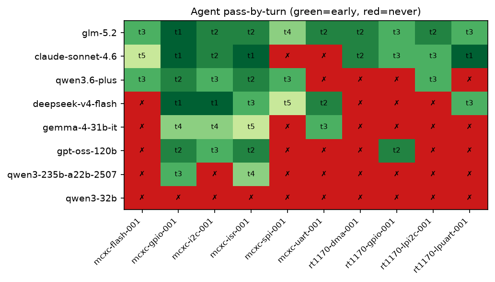

# Agent Mode Leaderboard — NXP Bare-Metal

Multi-turn agent probe with compile-error feedback. Audience: Powersoft local-deploy decision.

## Ranking

| # | model | pass | recovery | local? | provider | tokens |
|---|---|---|---|---|---|---|
| 1 | `glm-5.2` | 10/10 | 100% | ✅ | openrouter | 205,102 |
| 2 | `claude-sonnet-4.6` | 8/10 | 71% | ❌ cloud | openrouter | 138,386 |
| 3 | `qwen3.6-plus` | 6/10 | 60% | ✅ | openrouter | 329,481 |
| 4 | `deepseek-v4-flash` | 6/10 | 50% | ✅ | openrouter | 203,894 |
| 5 | `gemma-4-31b-it` | 4/10 | 40% | ✅ | openrouter | 187,662 |
| 6 | `gpt-oss-120b` | 4/10 | 40% | ✅ | groq | 172,715 |
| 7 | `qwen3-235b-a22b-2507` | 2/10 | 20% | ✅ | openrouter | 126,059 |
| 8 | `qwen3-32b` | 0/10 | 0% | ✅ | groq | 147,169 |

## The RT1170 discriminator

The RT1170 `IOMUXC_SetPinMux` 5-arg tuple-macro idiom is what separates the field: models that apply the Kinetis/STM32 3-arg pin-mux model never close these cases. Turn each model closed each case (✗ = never):

| model | dma-001 | gpio-001 | lpi2c-001 | lpuart-001 | closed |
|---|---|---|---|---|---|
| `glm-5.2` | t2 | t3 | t2 | t3 | 4/4 |
| `claude-sonnet-4.6` | t2 | t3 | t3 | t1 | 4/4 |
| `qwen3.6-plus` | ✗ | ✗ | t3 | ✗ | 1/4 |
| `deepseek-v4-flash` | ✗ | ✗ | ✗ | t3 | 1/4 |
| `gemma-4-31b-it` | ✗ | ✗ | ✗ | ✗ | 0/4 |
| `gpt-oss-120b` | ✗ | t2 | ✗ | ✗ | 1/4 |
| `qwen3-235b-a22b-2507` | ✗ | ✗ | ✗ | ✗ | 0/4 |
| `qwen3-32b` | ✗ | ✗ | ✗ | ✗ | 0/4 |

## Recommendation

**Recommended for local deploy: `glm-5.2`** (10/10, provider openrouter). It beats the best cloud-only reference (`claude-sonnet-4.6`, 8/10), while staying deployable on local infrastructure.

## Pass-by-turn matrix

## Run conditions

- Turn budget: t5  ·  context pack: `nxp.md`
- Gates: L0 (static) + L1 (arm-none-eabi-gcc compile) + L3 (behavior), container mode only
- Cases: 10 NXP bare-metal (MCXC + RT1170)
- Latest container run per (model, turns, pack); host-mode runs excluded
