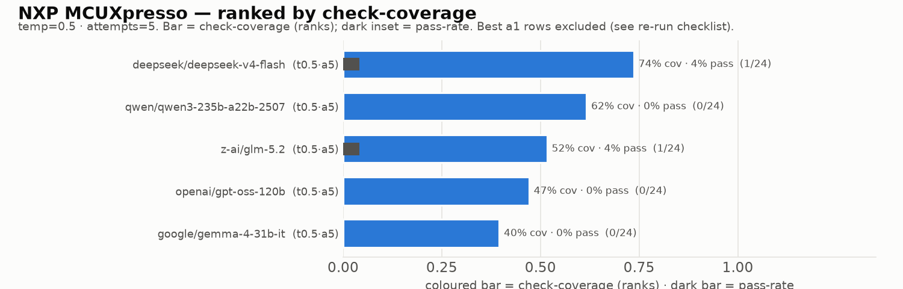
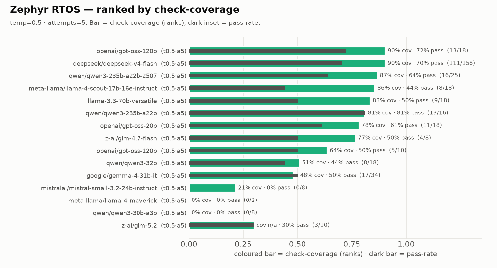
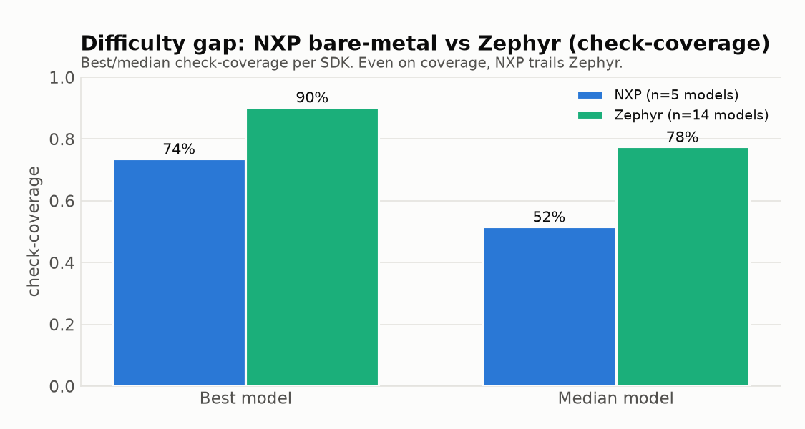
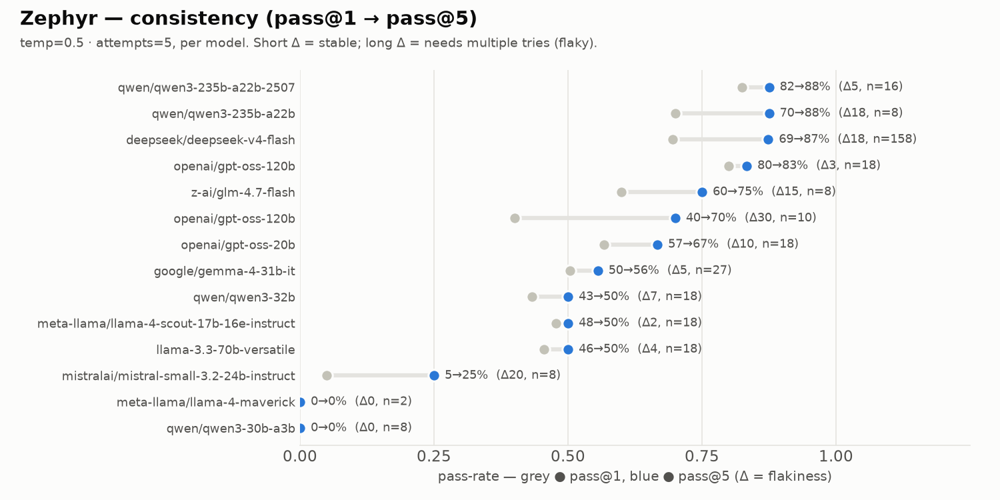
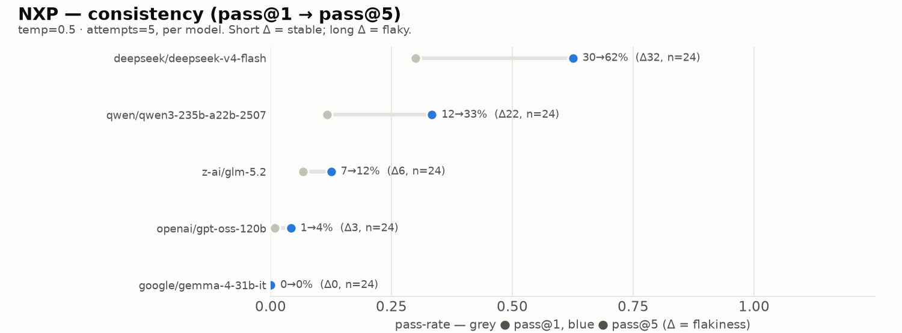
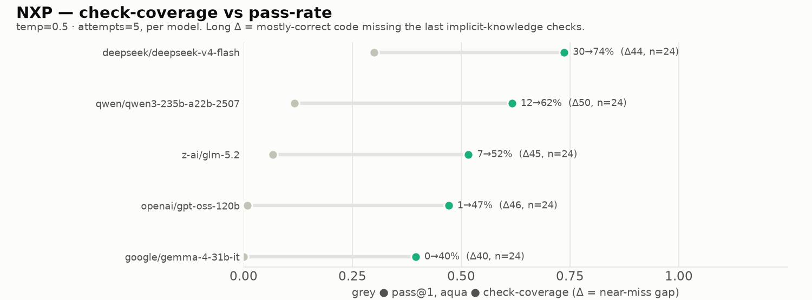
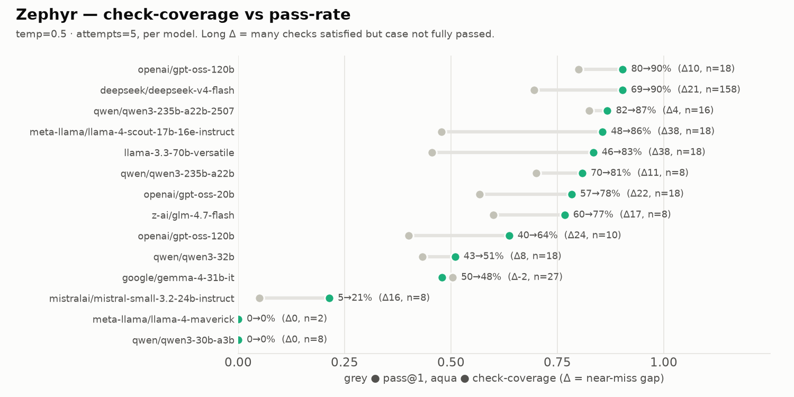

	 # Non-Agentic Performance Report — NXP vs Zephyr

**Scope:** non-agentic generation runs only (`scenario: generation`). Agent-mode /
multi-turn probes are excluded — see [`AGENT_LEADERBOARD.md`](AGENT_LEADERBOARD.md).
**Audience:** Powersoft local-deploy model-selection.

> **How the numbers are built — read this first.**
> Aggregation (`load_groups` in `src/embedeval/perf_report.py`):
> - All `generation` runs are merged and grouped by **(model, temperature, no_think, attempts)**.
>   The same model at a different temperature or attempt-count is a **separate row** —
>   that is why a model can appear more than once.
> - Within a group, the **last-written record per `case_id` wins** (union of runs).
> - The reported **pass-rate** = passed cases / covered cases for that config.
>   Because runs are unioned, denominators vary (e.g. a model retried across many
>   runs accumulates a larger denominator). These are the exact figures the
>   dashboard shows — not academic pass@1/pass@k.
>
> Cases are split by their `sdk` field: `mcuxpresso-sdk` = NXP, `zephyr` = Zephyr.
> The canonical NXP set is **24 cases**; the canonical Zephyr set is smaller and
> case-set size differs per model (shown in each denominator).
>
> **Filter (both leaderboards): `temperature=0.5, attempts=5` only** — so every
> row shares the same sampling budget and is directly comparable.
>
> **Ranking metric = check-coverage**, not pass-rate. `check_coverage` (mean
> `total_score`) is the average fraction of checks a model satisfies per case. On
> hard SDKs pass-rate collapses to ~0 and stops discriminating, so coverage —
> "how close did the code get" — is the primary ranking. Pass-rate is shown as the
> secondary (dark inset) metric. Coverage is read from each model's richest
> single-SDK a5·t0.5 run; pass-rate from the union leaderboard — so for a given
> model the two can come from different runs (a documented trade-off, see §4–5).

---

## 1. NXP MCUXpresso — bare-metal firmware

**Filter: `temperature=0.5, attempts=5` only.** **check-coverage** = average
fraction of checks satisfied per case (the project's `check_coverage`, i.e. mean
`total_score`) — how close the code got even when the case did not fully pass.

**Ranked by check-coverage** (primary metric — pass-rate is near-zero and does not
discriminate here):

| model                        | check-cov | pass-rate | passed |
| ---------------------------- | --------- | --------- | ------ |
| `deepseek/deepseek-v4-flash` | **74%**   | 4%        | 1/24   |
| `qwen/qwen3-235b-a22b-2507`  | **62%**   | 0%        | 0/24   |
| `z-ai/glm-5.2`               | 52%       | 4%        | 1/24   |
| `openai/gpt-oss-120b`        | 47%       | 0%        | 0/24   |
| `google/gemma-4-31b-it`      | 40%       | 0%        | 0/24   |

**Reading it:**
- Ranked by coverage, **`deepseek-v4-flash` (74%)** and **`qwen3-235b-a22b-2507`
  (62%)** lead — despite both passing ~0 cases. Pass-rate alone would call the whole
  field a failure; coverage shows the models write mostly-correct NXP code and trip
  on the *last one or two* checks per case (pin-mux idiom, clock ordering, device
  symbols). A far more hopeful signal, and the strongest argument for a feedback
  loop (§5).
- ⚠️ The pass-rate column excludes the strongest results seen so far, all from
  `attempts=1` probe runs (`qwen3-235b-a22b-2507` 8/24, `opus-4.8` 4/6). Tracked
  for a clean a5 re-run in [`NXP_RERUN_CANDIDATES.md`](NXP_RERUN_CANDIDATES.md).

---

## 2. Zephyr RTOS — Kconfig / build

**Ranked by check-coverage:**

| model | check-cov | pass-rate | passed |
|---|---|---|---|
| `openai/gpt-oss-120b` | **90%** | 72% | 13/18 |
| `deepseek/deepseek-v4-flash` | **90%** | 70% | 111/158 |
| `qwen/qwen3-235b-a22b-2507` | 87% | 64% | 16/25 |
| `meta-llama/llama-4-scout-17b-16e` | 86% | 44% | 8/18 |
| `llama-3.3-70b-versatile` | 83% | 50% | 9/18 |
| `qwen/qwen3-235b-a22b` | 81% | 81% | 13/16 |
| `openai/gpt-oss-20b` | 78% | 61% | 11/18 |
| `z-ai/glm-4.7-flash` | 77% | 50% | 4/8 |
| `openai/gpt-oss-120b` (2nd run) | 64% | 50% | 5/10 |
| `qwen/qwen3-32b` | 51% | 44% | 8/18 |
| `google/gemma-4-31b-it` | 48% | 50% | 17/34 |
| `mistralai/mistral-small-3.2-24b` | 21% | 0% | 0/8 |
| `qwen/qwen3-30b-a3b` | 0% | 0% | 0/8 |
| `meta-llama/llama-4-maverick` | 0% | 0% | 0/2 |
| `z-ai/glm-5.2` | n/a | 30% | 3/10 |

**Reading it:**
- Ranked by coverage, **`gpt-oss-120b` and `deepseek-v4-flash` lead at 90%** —
  note this reorders the board: `qwen3-235b-a22b`, the pass-rate leader (81%),
  drops to 6th on coverage, because its pass ≈ cov (81/81) — when it fails, it
  fails wholesale, leaving no partial credit.
- The coverage-vs-pass gap flags *near-miss* models: `llama-4-scout` (86% cov but
  44% pass) and `llama-3.3-70b` (83% / 50%) write mostly-correct configs and miss a
  symbol or two — the best feedback-loop candidates (§5).
- Bottom rows: two 0/0 produced no usable output; `mistral` (21% cov) emits partial
  configs; `glm-5.2` coverage is n/a (no single-SDK a5·t0.5 run to read it from), so
  it sinks to the bottom ranked on pass-rate only.
- Denominators differ (deepseek 158 vs maverick 2) from how many runs each model
  accumulated — weight larger-n rows more.

---

## 3. Overall summary — the difficulty gap

The gap is shown on the **primary metric, check-coverage**:

| | best model | median model | (pass-rate, for reference) |
|---|---|---|---|
| **NXP bare-metal** | 74% | 52% | best 4% |
| **Zephyr config** | 90% | 78% | best 81% |

**The headline:** on **pass-rate** NXP looks ~10× harder than Zephyr (best 4% vs
81%). But on **check-coverage** the gap nearly closes — NXP best 74% vs Zephyr 90%,
median 52% vs 78%. The two metrics tell complementary stories:
- The huge pass-rate gap is real but *misleading about capability*: it is driven by
  the last one-or-two checks per NXP case, not by a wholesale inability.
- Coverage shows the models already have most of the required NXP knowledge — the
  difficulty is concentrated in a thin band of implicit details (clock/pin-mux
  ordering, device symbols, the RT1170 5-arg pin-mux idiom) that pass/fail
  amplifies into near-zero.

The two tasks still measure different abilities — **Zephyr** is largely *config
recall* (pick the right Kconfig symbols), while **NXP bare-metal** needs *implicit
domain knowledge applied first-try* — but the coverage view reframes NXP from
"unsolved" to "one feedback round away".

### Implication for the Powersoft local-deploy decision
- For **Zephyr-style config work**, an open-weight local model (`qwen3-235b`,
  `gpt-oss-120b`) is already a credible single-shot choice.
- For **NXP bare-metal SpeakerMate firmware**, single-shot *pass-rate* is not
  viable today (≤4%), **but coverage says the knowledge is largely there** (best
  models 62–74% of checks satisfied). The bottleneck is the last one-or-two
  implicit-knowledge checks per case, not raw capability.
- This is the strongest argument for a **human-in-the-loop / multi-turn feedback**
  workflow (measured separately in `AGENT_LEADERBOARD.md`): a loop that surfaces
  exactly the failing checks should convert much of that 62–74% coverage into
  passes — far more cheaply than reaching for a bigger model.

---

## 4. Consistency — pass@1 → pass@5

**Metric:** the project's official consistency measure (the New-Run form notes
*"min 5 attempts for consistency metric"*): the Chen et al. (2021) unbiased
`pass@k` estimator, already stored per run as `pass_at_1/3/5`. Each dot pair is
**pass@1 (grey) → pass@5 (blue)**; the gap **Δ = pass@5 − pass@1** is the flakiness:
- **Small Δ** → stable: if the model can do a case, it does it on the first try.
- **Large Δ** → flaky: it only lands the case with extra attempts (sampling luck).

> **Why these numbers differ from sections 1–2.** The leaderboards above use the
> dashboard's union/last-record-per-case rule, which keeps only *one* sample per
> case and cannot see across attempts. Consistency needs all 5 attempts, so it
> instead reads `pass_at_k` from each model's **richest single-SDK a5·t0.5 run**.
> A model can therefore look weak on the leaderboard (an unlucky run overwrote its
> good cases) yet show a strong pass@5 here — e.g. `deepseek-v4-flash` on NXP is
> 4% on the leaderboard but **30→62%** in its best a5·t0.5 run. Treat consistency
> as "best observed behaviour and its stability", not as the headline pass-rate.

### Zephyr

- **`gpt-oss-120b` (Δ3, 80→83%)** is the standout: high *and* stable — it rarely
  needs a retry. The best single-shot local pick for Zephyr config.
- **`qwen3-235b-a22b` (Δ18)** and **`deepseek-v4-flash` (Δ18)** reach the same 88%
  pass@5 but lean on multiple attempts — strong with a feedback loop, less so
  single-shot.
- The same model can be stable or flaky depending on the case-set (two
  `gpt-oss-120b` rows: Δ3 vs Δ30) — read Δ alongside n.

### NXP

- **`deepseek-v4-flash` (30→62%, Δ32)** and **`qwen3-235b-a22b-2507` (12→33%, Δ22)**
  show that NXP is *not* hopeless with multiple attempts — but the large Δ means
  single-shot NXP is unreliable, reinforcing the feedback-loop recommendation.
- These are the very rows the a5·t0.5 leaderboard hides behind unlucky 0/24 runs —
  another reason the [`NXP_RERUN_CANDIDATES.md`](NXP_RERUN_CANDIDATES.md) re-runs
  matter before drawing conclusions.

---

## 5. Check-coverage vs pass-rate — the "near-miss" gap

Same dumbbell form, different pair: **pass@1 (grey) → check-coverage (aqua)**. The
gap **Δ** is how much correct code a model produces *without* fully passing the
case — a long Δ means "mostly right, missing the last checks", the ideal target for
a feedback loop.

### NXP

This is the report's key finding for the local-deploy decision. **Every NXP model
sits Δ40–50 short of passing**: `deepseek-v4-flash` reaches 74% coverage,
`qwen3-235b-a22b-2507` 62%, yet both pass almost no cases. The models already write
mostly-correct NXP firmware and stumble only on the last one or two
implicit-knowledge checks (pin-mux idiom, clock ordering, device symbols). A
feedback loop that surfaces exactly those failing checks should close much of this
gap — far cheaper than reaching for a bigger model.

### Zephyr

Here the gap separates two model types. **Near-miss models** — `llama-4-scout`
(48→86%, Δ38), `llama-3.3-70b` (46→83%, Δ38) — are strong feedback-loop candidates:
they satisfy most checks but drop a symbol. **All-or-nothing models** —
`qwen3-235b-a22b` (70→81%, Δ11), `qwen3-235b-a22b-2507` (Δ4) — when they fail, they
fail wholesale, so a feedback loop buys them less.

---

*Regenerate with `uv run embedeval perf-report`. Leaderboards come from
`src/embedeval/perf_report.py::load_groups`; consistency and
check-coverage read `pass_at_k` / `check_coverage` from run summaries
(`src/embedeval/scorer.py`). Underlying figures in `_report_data.json`.*
